# PRINTER CONFIGURATION
{: .text-center }
[CONFIGURATOR DOWNLOAD]{: .btn .fs-6 .fw-300 .text-yellow-300 }
{: .text-center }
_last updated: 2024.06.24 18:00_{: .fs-3 .mt-0 .fw-300 }
{: .text-center }

*You will be guided through all the steps from the configurator and you will get helpful and detailed information for all the available options. This page aims to explain differences between options in more detail, but their affect on the BOM or required parts will show in the configurator file.*

    
<h4 style="display:inline-block;margin-left:1.5em"> WHAT IS THE CONFIGURATOR, HOW DOES IT WORK? </h4>

CONFIGURATOR is an all in one interactive spreadsheet that includes Configurator, Bill of material, Printed parts and list of verified/approved kits.
The Configurator will, based on your setup, automatically calculate the right quantities in the Bill of Material, show you the right parts to print and even the estimated cost of the BOM and the amount of filament needed. There are two macros included to show/hide unused parts to better organise the table but they are not neccessary to run if you have concerns.

BOM also includes links to buy parts - all links are affiliate and help by a small amount to the project with no added cost to you.

The default values are the recommended ones and were chosen for good balance between the price and performance.

The configuration is divided into three sections:

[BASE BUILD]{: .btn .fs-5 .fw-300 .text-yellow-300 .mr-7 .px-6 }
[TOOLHEAD]{: .btn .fs-5 .fw-300 .text-yellow-300 .mr-7 .px-6 }
[MODS / UPGRADES]{: .btn .fs-5 .fw-300 .text-yellow-300 .px-6 }
{: .text-center }

{: .note }
All the pictures bellow are higher resolution, so you can zoom in or right click - Open image in new tab/window - to view it in more detail.

# BASE BUILD
{: .text-center }

#### BASE PRINTER
Supported and tested printers for the conversion. Compatibility with other printers will be verified and tested over time so if you decide to use a different one for the conversion and want to help with the implementation, please give me feedback. There are also dimensions for the aluminium extrusions in the BOM, so you can check the compatibility yourself or even build the printer from scratch.
- Creality Ender 3 - has 2040 x 330 mm extrusion for Y axis - printed spacer is used.
- Creality Ender 3 Pro - default, has 4040 x 350 mm extrusion for Y axis.
- Creality Ender 3 V2 - some have shorter 4040 extrusion for Y axis - printed spacer is used.

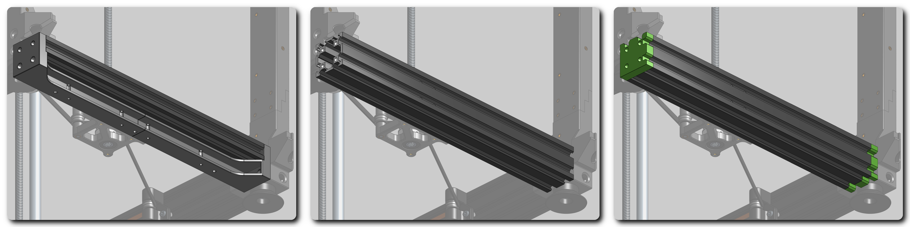

#### ENCLOSURE
Choosing to enclose the printer or not. V2 style enclosure is better designed and simpler while also adding to the frame rigidity. For the best experience, recommended polycarbonate panels are 4mm thick + 5mm for the front door. Rear electronics cover can be 3mm.

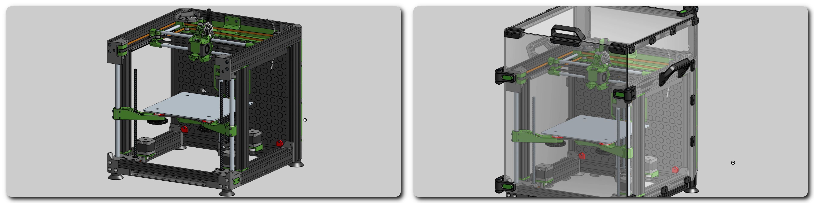

#### FRAME
- Printed verticals - legacy version where you don't need to buy extra extrusions. Depending on your filament and market prices, it can also be the cheapest option.
- 2040 update - RECOMMENDED - first stage upgrade with additional alu extrusion. Adds rigidity to the frame.
- Ulti frame - all you need for the best performance, adds two more extrusions to the front, uses butt joints so it requires more driling and tapping threads.

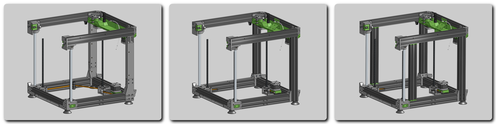

#### Z AXIS RODS
- 2x12 mm rod - legacy version - simple setup that works well enough if your leadscrews are not extremely bent, it also saves few dollars.
- 3x12 mm rod - RECOMMENDED - uses linear rod at the rear leadscrew, makes the bed carriage more stable. This is required if you plan to use tilting bed _(once it is released)_.

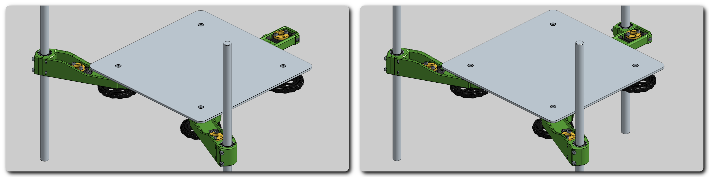

#### BED CARRIAGE
- Printed - although it works, it is not recommended. It is a backup option for people who cannot use one of the others.
- Stock E3 bed carriage - RECOMMENDED - reuse the stock Ender's bed carriage.
- Metal carriage - cut with laser od water, most rigid option, if you want to get the best out of your printer.
- _Z-tilt bed - in development_

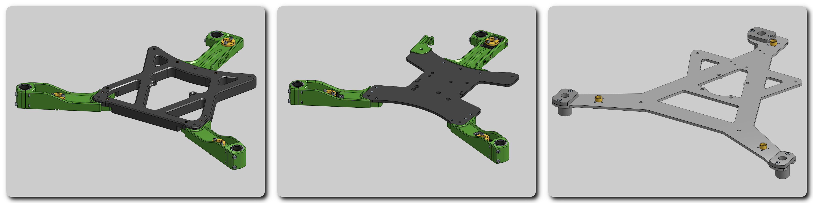

#### Z WOBBLE COMPENSATION
- None - no Z wobble compensation, T8/8 nuts mounted directly.
- Flexi joint - RECOMMENDED - printed flexible inserts that compensate leadscrew runout.
- WobbleX - more efficient solution by MirageC, but it reduces the max Z by around 22 mm.

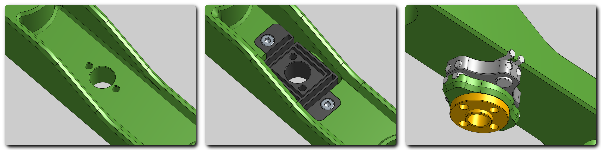

#### Z AXIS DRIVE
- 1 stepper - RECOMMENDED - more foolproof and simple solution with one stepper and long belt driving all 3 leadscrews, also cheaper.
- 3 steppers - for separately driven leadscrews and Z-tilt option. This is required if you plan to use tilting bed _(once it is released)_, but currently this option isn't recommended as there is no compliant mechanism in the bed carriage, which would allow the bed to tilt safely and even a small amount of tilt from improper alignment may increase binding and friction in the Z axis. If you select this option, be very careful and make sure your bed is aligned well resulting in minimal tilt.

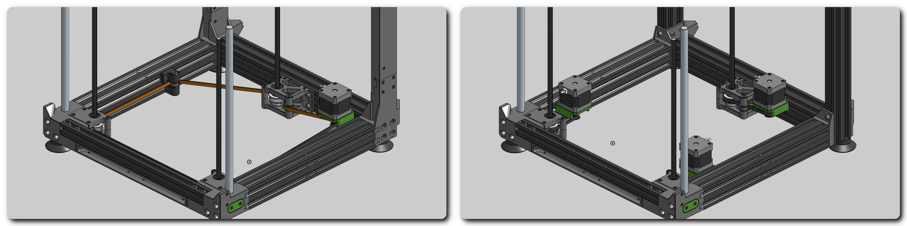

#### LEADSCREW PULLEYS
- Printed - legacy version - cheap and simple option but for good performance it is important to verify that there is no ovality in pulleys and the print is precise.
- Aluminium - RECOMMENDED - precise aluminium pulley equals precise leadscrew rotation.

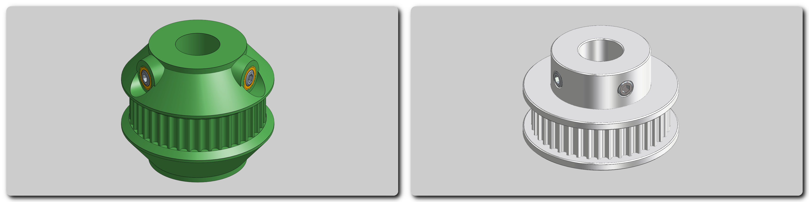

#### PSU THICKNESS
- 30 mm - thinner Meanwell PSU used in Ender 3 Pro and in some Ender 3 V2
- 50 mm - thicker PSU used in Ender 3 and in some Ender 3 V2

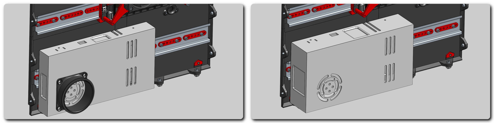

#### BOARD MOUNT
Currently there are setups for only few motherboards but more will be directly supported in the future. The supported board has DIN rail mount along with cooling fan holder and there is also a FW setup available. But being the boards mounted on DIN rails, it is easy to use any other board. It is also recommended to check the **Optional parts** folder where there are mounts for other electronics commonly used.
- BTT SKR mini E3 v2
- BTT SKR3EZ
- BTT Octopus

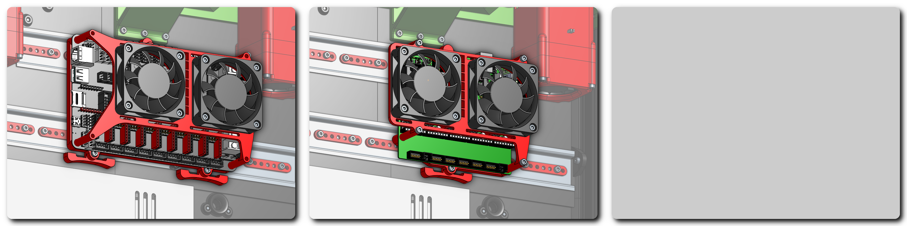

# TOOLHEAD
{: .text-center }
Toolhead is put together with separate parts for mounting each of the components which makes it super easy to alternate between different type of hardware.

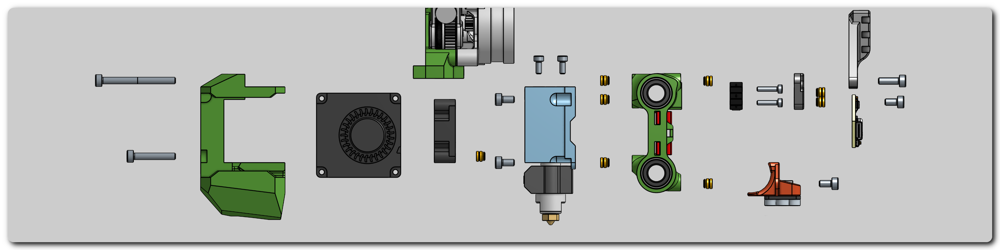

#### HOTEND
Select the hotend you want to use, it is generaly recommended to use hotend with higher flow.

    
<h4 style="display:inline-block;margin-left:1.5em;color:#5ca33c"> COMPATIBLE HOTENDS </h4>

Listed hotends were directly tested in the CAD design or/and in real life and have a specific mount, so it is verified they can be used. Some of the mount styles are widely used so the real compatibility list will be even bigger.

• BambuLab hotends

• Creality MK8

• Creality Spider V3

• Creality Spider V3 + Volcano nozzle or Meltzone extender

• DropEffect neXtG HF

• DropEffect neXtG UHF

• E3D V6

• E3D V6 Volcano

• E3D Revo Voron

• Goliath air

• Phaetus Dragon SF

• Phaetus Dragon HF

• Phaetus Dragon 2 HF

• Phaetus Dragon 2 UHF

• Phaetus Dragonfly BMS

• Phaetus Rapido (2) HF

• Phaetus Rapido (2) UHF

• TriangleLab ACE

• TriangleLab ACE+

    
<h4 style="display:inline-block;margin-left:1.5em;color:#FF0000"> WARNING! </h4>

Hotends with E3D groove mount heatsink are not generaly recommended with the E3NG toolhead. The reason is the long heatsink which doesn't properly fit and because of it the heatsink cooling is not optimal. I couldn't test it myself yet but i believe it may cause clogs due to heatcreep in some situations.

If you are willing to test it, please let me know.

Instead of the E3D groove mount, I recommend using the V6DM heatsink by TriangleLab which is a direct replacement and it uses a 4 screw mount.

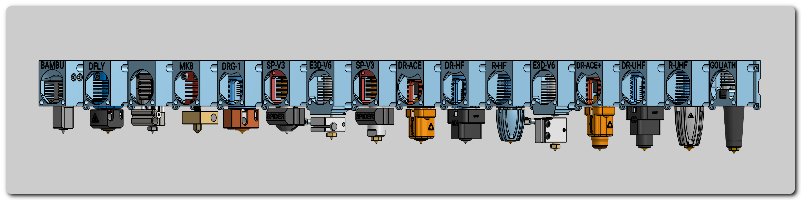

#### EXTRUDER
- Bowden - adapter plate with different bowden connectors - bowden clip / ECAS04 / M6 thread (used on stock Ender extruder) / 1/8' thread (used on stock Ender hotend) / SpiderV3 coupler / Phaetus groove mount adapter
- Original design extruders - adapter plates with the most common mounts to fit the majority of direct drive extruders.
- Integrated - direct drive extruders with integration into the toolhead mount. Makes mounting the extruder more secure and rigid while still being easy to swap.

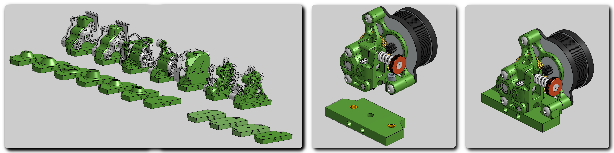

#### PART COOLING
- 2 x 4010 - RECOMMENDED - compact and solid option with higher RPM fans - good option for most of the users.
- 2 x 4020 - step up in performance from the previous 4010 fans.
- 2 x 5015 - even more air.
- CPAP - the best choice for extreme cooling and lightweight toolhead, although you can always add auxiliary fans too.

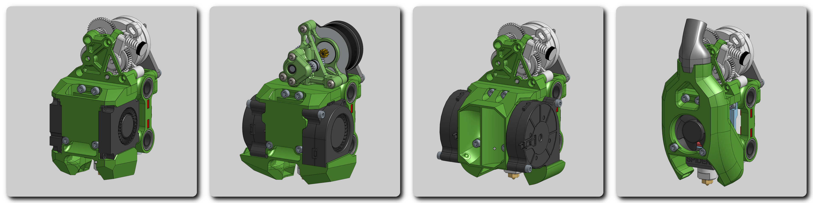

#### BED PROBE
Choose the right bed probe for you.
- KlickyPCB - RECOMMENDED cheap option with good reliability.
- BDSensor - RECOMMENDED performance option - it is recommended more than Beacon scanner as it doesn't have the "no metal" zone that is forcing Beacon to be further from the nozzle because of the lower LM8LUU. BDSensor is currently more complicated to install but Klipper integration is in the works.

    
<h4 style="display:inline-block;margin-left:1.5em;color:#5ca33c"> COMPATIBLE PROBES </h4>

Listed probes were directly tested in the CAD design or/and in real life and have a specific mount, so it is verified they can be used.

<ul style="margin-left:1.5em;font-size:12px">
<li>BDsensor</li>
<li>Beacon scanner</li>
<li>BIQU microprobe</li>
<li>BLTouch</li>
<li>BTT Eddy</li>
<li>CR Touch</li>
<li>Klicky probe</li>
<li>KlickyPCB</li>
<li>P.I.N.D.A. / SuperPINDA</li>
</ul>

    
<h4 style="display:inline-block;margin-left:1.5em;color:#FF0000"> WARNING! </h4>

When building version with three Z linear rods and using some of the directly mounted probes (BDsensor, Beacon scanner, BTT Eddy, P.I.N.D.A.) with a longer hotend, keep in mind, there can be a conflict between the rear Z rod and the probe. In normal operation it is not an issue becauce it is only a small zone outside the print and homing area but can happen during maintenance or when not set properly.

Keep this in mind so you don't brake your probe mount or even the probe.

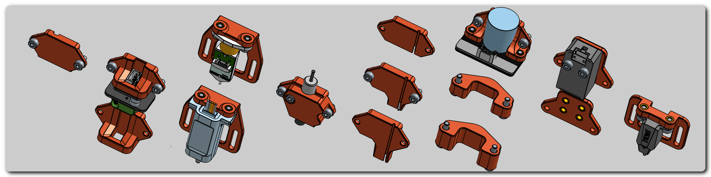

#### ACCESSORIES
- Cable guide - RECOMMENDED for keeping the toolhead wiring clean and safe.
- Breakout board - cheap DIY alternative to toolhead PCB boards using female JST XH connectors and wires directly soldered to them. 5x2pin and 1x3pin
- Accelerometer mount - it is recommended to use nozzle mounted for your accelerometer but this option is easier/faster to use. It has KUSBA as well as ADXL345 mount pattern.

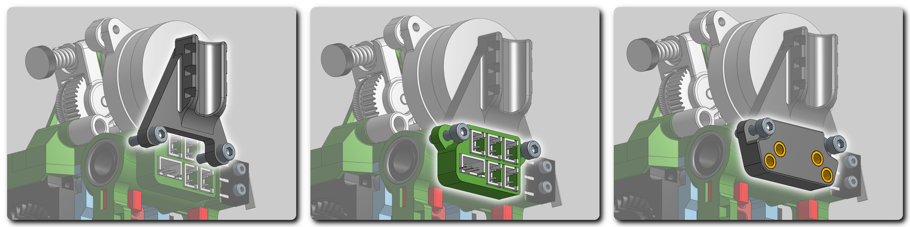

# MODS / UPGRADES
{: .text-center }

#### STEPPER COOLING
RECOMMENDED - optional active cooling for AB steppers using 4020 axial fans. It is simple yet very effective solution that keeps your steppers cool allowing you to increase the run current and print faster.

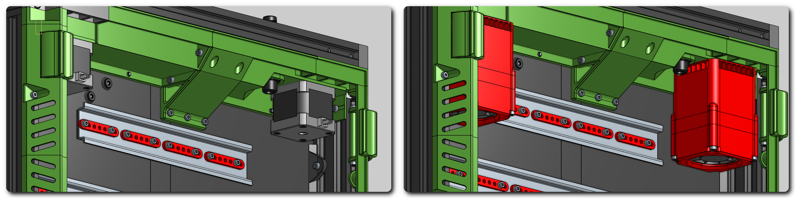

#### FRAME BRACES
Recommended if you are using legacy version of the frame without the enclosure. It adds a bit more rigidity to the frame but other frame variants are rigid enough and the enclosure is even superior in that regard.

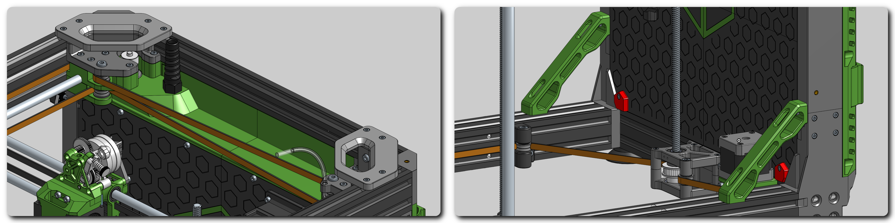

#### HANDLES
Handles - RECOMMENDED - to have a good grip on the printer. Handles are automatically added if you select enclosure.

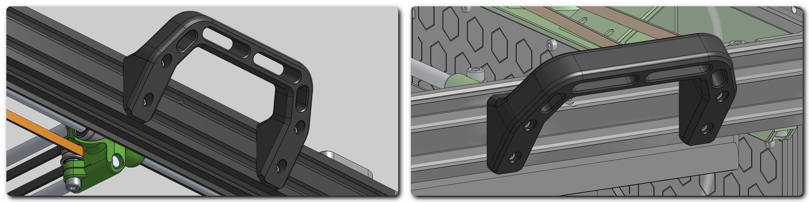

#### LED LIGHTS
- Frame LEDs - RECOMMENDED - LED strips mounted on the frame in the nozzle height to better see the prints.
- Enclosure LEDs - RECOMMENDED - LED strips mounted on the upper edge of the enclosure to light up the inside of the printer.

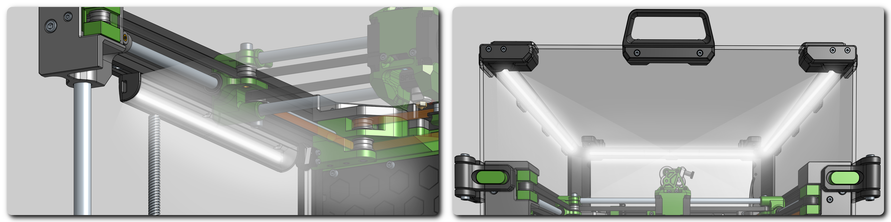

#### AUX COOLING
Auxiliary side cooling using 12032 fans blowing air over the build plate from both sides. For more powerful cooling for your prints.

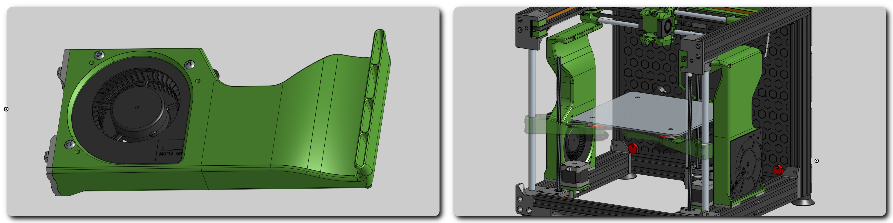

#### BED WIRING - WAGO 221
For running bed heater cables from your board into the connectors mounted on the bed carriage. It helps with serviceability as you can remove the bed completely without removing all the cables. It uses Wago 221 connectors for the heater wiring and JST XH connectors for the thermistor and/or under bed fan.
- DC BED - for DC - usually 24V bed heaters.
- AC BED - for AC bed heaters including connector for the ground wire.

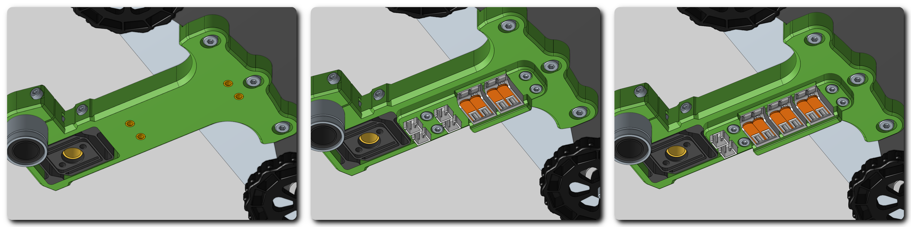

#### UNDER BED FAN
RECOMMENDED if you install enclosure. Helps circulating the air inside the chamber and heating it faster and more evenly by sucking the warm air from below the heated bed and blowing it at the bottom. It is moving/mixing air in the entire enclosure.

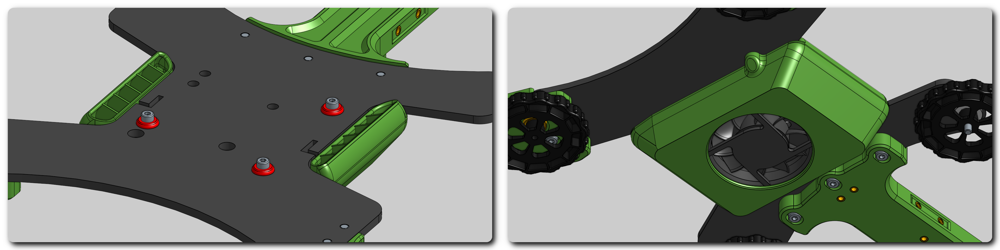

#### AUTO Z - VORON
Original Voron design for Auto-Z offset with using "Sexbolt" nozzle endstop.

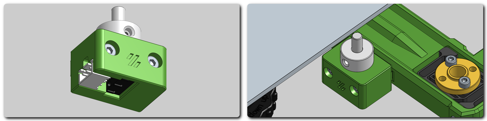

continue to:
{: .text-right .lh-0 .pt-8 }

[SOURCING PARTS]{: .btn .fs-6 .fw-300 .text-yellow-300 }
{: .text-right }

[CONFIGURATOR DOWNLOAD]: https://rh3d.xyz/configure.html
[BASE BUILD]: https://rh3d.xyz/configure.html#base-build
[TOOLHEAD]: https://rh3d.xyz/configure.html#toolhead
[MODS / UPGRADES]: https://rh3d.xyz/configure.html#mods--upgrades
[SOURCING PARTS]: https://rh3d.xyz/sourcing.html
