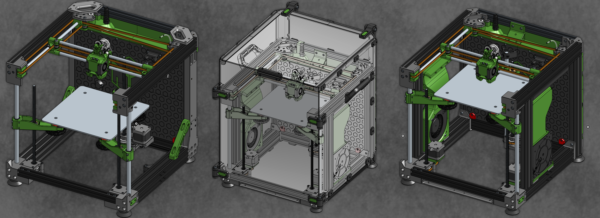

# ENDER 3 NG
{: .text-center }

This project is a DIY conversion originaly based on Creality Ender 3 Pro. The original Ender 3 was one of the most sold printers but due to its lack of modern features, it is rather a starting point for people who either can't afford to buy a more expensive machine or don't want to spend money on something they just want to try.

That is a reason why many want to move forward and the old and simple Ender 3 don't have much use anymore, especially with the printers that are on market these days.

Main goal of this project is to use the old Ender 3, tear it apart and reuse as many stock parts as possible to build something that is on a whole different level and on par with the modern machines you see everywhere now. The new printer must be more reliable, faster, having more great features and capabilities and options for further upgrades (honestly, who coming here with an Ender 3 isn't looking for upgrades?).

It is based on CoreXY motion system, is easy to enclose and you can do a cheap and simple build or you can go crazy and really step up the performance possibilities, but even the cheap option offers a significant performance boost from your stock Ender 3.

Of course, you also need aditional parts for the conversion.
# "NG = NEXT GENERATION"
{: .text-center }

#### PRINTER FEATURES
- Build volume _(X-Y-Z)_: 235 x 235 x 245 mm (max Z depends on the used hotend)
- Printer size _(X-Y-Z)_: 407 x 438 x 440 mm / 455 x 485 x 548 mm (enclosed)
- CoreXY motion system
- Frame build with 7 out of 8 Ender 3 Pro aluminium extrusions + additional parts
- Supports stock stepper motors, hotend", PSU, motherboard" (32bit), bed, bed carriage, screen, extruder" and more. _("not all is recommended)_
- Linear rods for X, Y and Z motion system.
- Triple leadscrew for Z movement, belt connected with 1x NEMA17 stepper or 3x individual Z steppers.
- Bed carriage with printed anti Z wobble system.
- Enclosed electronics on the back of the printer.
- DIN rails in electronics compartment for easy organization.
- Optimized shape for enclosure.
- Toolhead compatibility with majority of hotends, direct drive extruders and bed probes.
- Toolhead with 4 variants of part cooling - dual 4010, dual 4020, dual 5015, CPAP.
- Space behind the bed ready for more upgrades – nozzle brush, purge bucket etc.
- Files are designed for easy printability and functionality.
- Many options in the project configuration part to make everyone happy.
- Huge amount of ideas for future upgrades.

#### OTHER (OPTIONAL) FEATURES
- Under bed fan for air circulation and faster chamber heating.
- Active cooling for AB stepper motors.
- Auxiliary fans with 12032 blowers.
- Lasercut metal bed carriage for the best stability.
- Z axis with printed antiwobble inserts or support for WobbleX.
- and more.

continue to:
{: .text-right .lh-0 .pt-8 }

[INTO THE PROJECT]{: .btn .fw-300 .fs-6 .text-yellow-300 }
{: .text-right }

[INTO THE PROJECT]: https://rh3d.github.io/E3NG_docs/into.html
