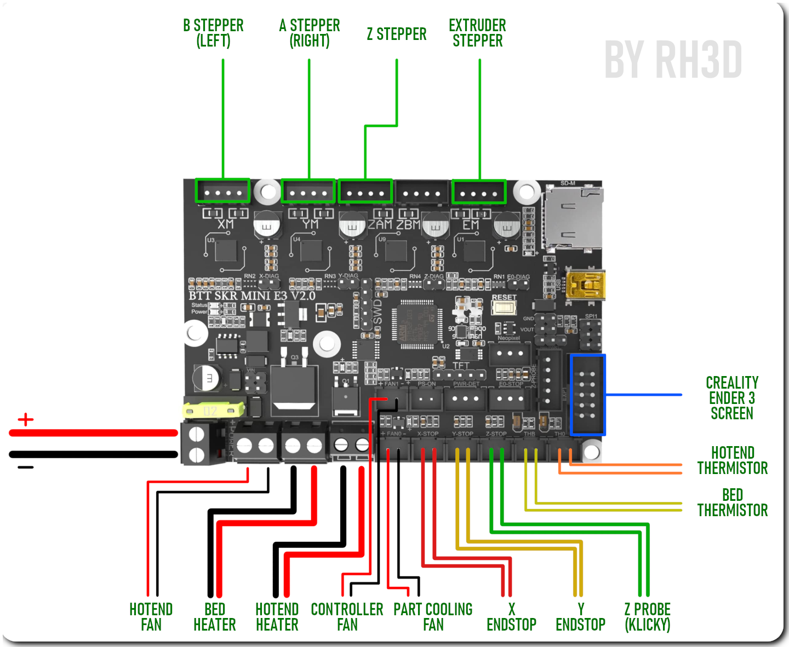

# MARLIN FW
{: .text-center }

{: .warning }
This page is under construction.

Officialy supported motherboards:
- [BTT SKR 3 EZ]
- [BTT SKR mini E3 V2]

#### BigTreeTech SKR 3 EZ
{: .text-center }
[download package](./assets/fw/E3NG_M2.1.x_config_SKR3EZ.zip)
{: .text-center }
[Official BTT documentation](https://github.com/bigtreetech/SKR-3/tree/master/Hardware%20(SKR%203%20EZ))
{: .text-center }

#### BigTreeTech SKR mini E3 V2
{: .text-center }
[download package](./assets/fw/E3NG_M2.1.x_config_SKRminiE3v2.zip)
{: .text-center }
[Official BTT documentation](https://github.com/bigtreetech/BIGTREETECH-SKR-mini-E3/tree/master/hardware/BTT%20SKR%20MINI%20E3%20V2.0/Hardware)
{: .text-center }

[BTT SKR 3 EZ]: https://rh3d.xyz/marlin.html#bigtreetech-skr-3-ez
[BTT SKR mini E3 V2]: https://rh3d.xyz/marlin.html#bigtreetech-skr-mini-e3-v2
