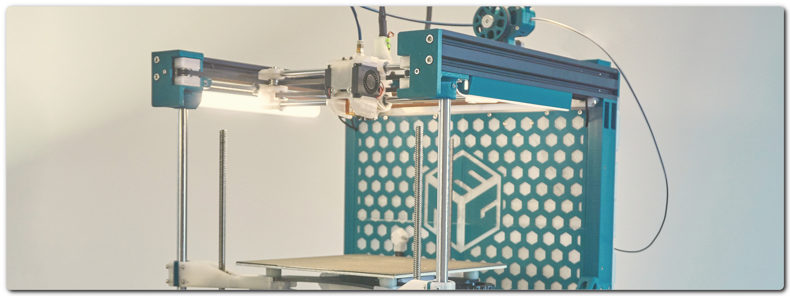
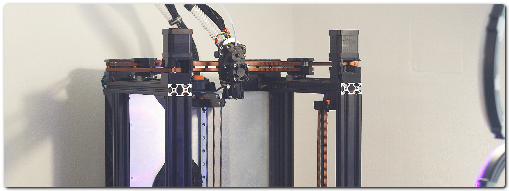

# ENDER 3 NG (E3NG)

The legacy design that transforms your basic Ender 3 into a Next Generation machine. Want to keep it simple and affordable or go fully loaded? The choice is yours.

{: .text-center .mt-4 }

---

# VIRTU E3

The second-generation hero, built to revive all the unused Enders. Purity, speed, precision — this is Virtu.

{: .text-center .mt-4 }

---

## About RH3D

Hi! I’m Radek—engineer, architect, woodworker, and maker by nature. I was born into a family of engineers in the Czech Republic, and from a young age, I found joy in creating. Whether it was building something with my hands or dreaming up designs on paper, I was always drawn to the process of turning ideas into reality.

My journey has taken me through engineering, woodworking, and ultimately back to my original profession—architecture. But beyond the workshops and design boards, I’m also a proud husband and loving father. My family keeps me grounded and inspired, and they’ve been my biggest supporters through every prototype and late-night tinker session.

## How did I get into 3D printing?

I was always fascinated by the technology, but without a clear use case, I couldn't justify owning a printer. That changed when I got an old Ender 3 Pro to support a few side projects in my woodworking business. Who could’ve guessed I’d get completely hooked—printing, upgrading, modifying... like most of the Ender 3 owners, right?

## The first Ender 3 NG

Once you dive in, it’s tough to stop. I realized there were more capable designs within reach. After plenty of research, modifications, and testing, the Ender 3 NG was born. It started as a personal project to convert an Ender 3 into an enclosed CoreXY machine on a budget—but it grew into something far more meaningful. This journey has led me to create amazing things, build a thriving community, and connect with passionate people from around the world.
