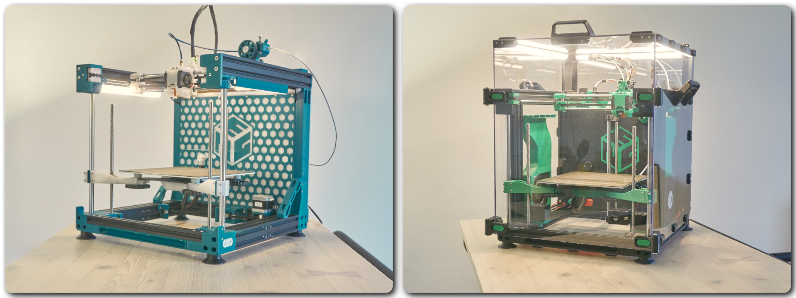

# E3NG (ENDER 3 NG)
{: .text-center }

**Take your old, unused Creality Ender 3 and turn it into something amazing—something fast, powerful, precise, and reliable and enjoy the new level of tinkering.**
{: .text-center }

E3NG is a DIY project focused on reviving up to **78%*** of parts from your original printer and giving them a brand-new purpose. Many of us started with the simple Ender 3, and it taught us a lot—but 3D printing has evolved, and it’s time to step up. That’s exactly what this conversion is all about.

Originally designed for the Ender 3 Pro, it also supports other models like the V2, Neo, and even the non-Pro variant. The goal? Reuse as much as possible and build a machine that’s significantly faster, more reliable, easy to enclose, and still totally upgradable—because let’s face it, no one with an Ender 3 is done tinkering.

Whether you go with a low-budget build or max out performance, you’ll turn your Ender 3 into a CoreXY machine that honors its roots—while bringing it into the next generation of printers.

There are two versions to choose from:
 - **v1.2S (standard)** offers a more streamlined, kit-style approach with clear instructions and a straightforward build path—perfect if you prefer to keep things more simple.
 - **v1.2 (advanced)** is for those who like to go deep into the project, tweak every detail, giving you the flexibility to configure your printer to match your own preferences and setup.

# "NG = NEXT GENERATION"
{: .text-center }

#### PRINTER FEATURES
- Build volume _(X-Y-Z)_: 235 x 235 x 245 mm (max Z depends on the hotend used)
- Printer size _(X-Y-Z)_: 407 x 438 x 440 mm ( 455 x 485 x 548 mm enclosed )
- CoreXY motion system
- Frame build with 7 out of 8 Ender 3 Pro aluminium extrusions + additional parts
- Supports stock stepper motors, hotend", PSU, motherboard" (32bit), bed, bed carriage, screen, extruder" and more. _("not all is recommended)_
- Linear rods for X, Y and Z motion system.
- Triple leadscrew for Z movement, belt connected with 1x NEMA17 stepper or 3x individual Z steppers.
- Bed carriage with printed anti Z wobble system.
- Enclosed electronics on the back of the printer.
- DIN rails in electronics compartment for easy organization.
- Optimized shape for enclosure.
- Toolhead compatibility with majority of hotends, direct drive extruders and bed probes.
- Toolhead with 4 variants of part cooling - dual 4010, dual 4020, dual 5015, CPAP.
- Space behind the bed ready for more upgrades – nozzle brush, purge bucket etc.
- Files are designed for easy printability and functionality.
- Many options in the project configuration part to make everyone happy.
- Huge amount of ideas for future upgrades.

#### OTHER (OPTIONAL) FEATURES
- Under bed fan for air circulation and faster chamber heating.
- Active cooling for AB stepper motors.
- Auxiliary fans with 12032 blowers.
- Lasercut metal bed carriage for the best stability.
- Z axis with printed antiwobble inserts or support for WobbleX.
- and more.

continue to:
{: .text-right .lh-0 .pt-8 }

[INTO THE PROJECT]{: .btn .fw-300 .fs-6 .text-yellow-300 }
{: .text-right }

[INTO THE PROJECT]: https://rh3d.xyz/into.html
