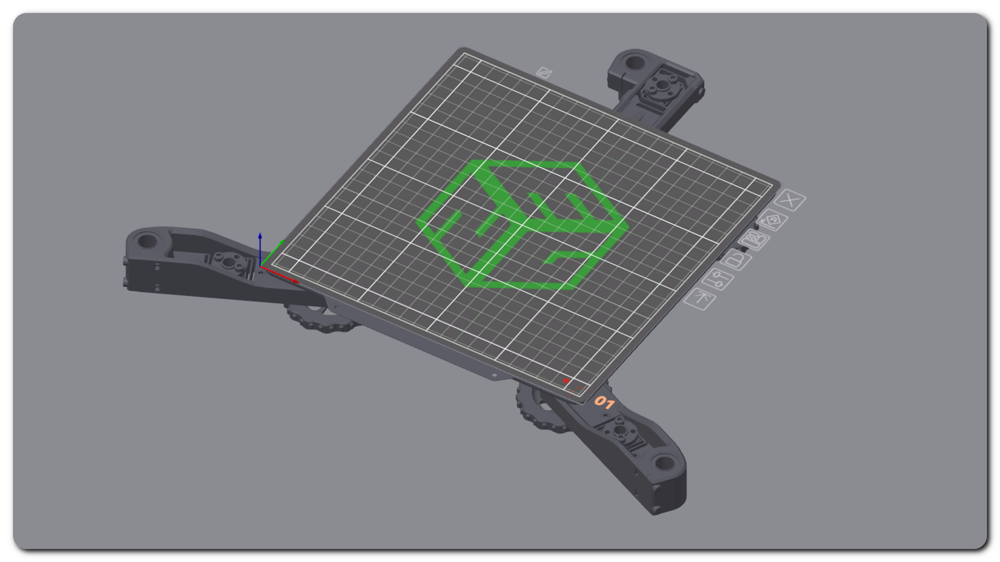

# PRINTER SETUP AND CALIBRATION
{: .text-center }

{: .warning }
This page is under construction and will be completed later.

# SLICER SETUP
{: .text-center }

[BED PLATE TEXTURE - E3NG_build_plate.svg]{: .btn .fs-6 .fw-300 .mt-6 .text-yellow-300 }
{: .text-center }

[BED MODEL - E3NG_bed.stl]{: .btn .fs-6 .fw-300 .mt-6 .text-yellow-300 }
{: .text-center }

continue to:
{: .text-right .lh-0 .pt-8 }

[PRINTER MAINTENANCE]{: .btn .fs-6 .fw-300 .text-yellow-300 }
{: .text-right }

[PRINTER MAINTENANCE]: https://rh3d.xyz/maintenance.html
[BED PLATE TEXTURE - E3NG_build_plate.svg]: ./assets/docs/E3NG__build_plate.svg
[BED MODEL - E3NG_bed.stl]: ./assets/docs/E3NG_bed.stl
